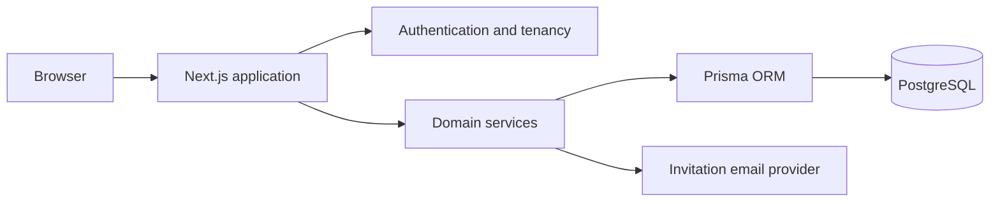

# Open Impact EJ

Plataforma open source de gestão integrada para Empresas Juniores.

## Visão geral

O Open Impact EJ reúne diretorias, projetos, tarefas, reuniões, finanças e pessoas em um só lugar. A aplicação é multi-organização, mantém contas globais separadas das associações locais e aplica isolamento de dados em todos os serviços de domínio.

## Funcionalidades

### Diretorias

Estrutura organizacional, membros, liderança única, arquivamento seguro e histórico auditável.

### Projetos

Projetos com múltiplas diretorias, responsáveis, prazos, progresso, histórico e controle de concorrência.

### Tarefas

Listas e quadro, múltiplos responsáveis, filtros, prioridades, conclusão e preservação do histórico.

### Agenda e reuniões

Agenda mensal, semanal e em lista; reuniões para toda a EJ, diretorias, pessoas e convidados externos.

### Disponibilidade

Enquetes de horários com seleção e limpeza completa das respostas.

### Finanças

Entradas e saídas em centavos inteiros, vínculos com diretoria e projeto, filtros, resumo e cancelamento auditado.

### Pessoas e convites

Conta global, associações por organização e convites expiráveis cujo token é armazenado apenas como hash.

### Ajustes da organização

Identidade, pessoas, convites e liderança, disponíveis a Superadmin, Presidência e Conselho.

### Notificações e busca

Notificações acionáveis e busca isolada por organização em diretorias, pessoas, projetos, tarefas e reuniões.

## Capturas de tela

Capturas não são versionadas para evitar imagens desatualizadas. Execute a aplicação localmente para revisar a interface responsiva real.

## Arquitetura



Consulte [docs/architecture.md](docs/architecture.md), [docs/data-model.md](docs/data-model.md) e [docs/permissions.md](docs/permissions.md).

## Tecnologias

Next.js 16, React 19, TypeScript, Prisma, PostgreSQL 16, Tailwind CSS, Node test runner e Playwright.

## Requisitos

- Node.js 22
- npm 10 ou superior
- PostgreSQL 16, local ou via Docker

## Instalação local

```bash
npm ci
docker compose up -d postgres
cp .env.example .env
npx prisma migrate deploy
npm run dev
```

## Configuração do ambiente

Copie `.env.example`. Troque `AUTH_SECRET` por um valor aleatório com pelo menos 32 caracteres. O envio de convites por Resend é opcional.

## Banco de dados

Novas instalações usam a baseline standalone em `prisma/migrations`. Não execute o schema antigo de estudos em uma instalação nova. Veja [docs/migration-from-legacy-open-impact.md](docs/migration-from-legacy-open-impact.md).

## Primeiro acesso

```bash
npm run organization:bootstrap -- \
  --organization-name "Empresa Júnior Exemplo" \
  --organization-slug "ej-exemplo" \
  --admin-email "presidencia@example.org" \
  --admin-name "Presidência"
```

O comando exibe uma única vez o link seguro para concluir o acesso inicial; não registra senha por padrão. Para dados locais não produtivos, use `npm run seed:demo`.

## Comandos disponíveis

- `npm run dev`, `build` e `start`: aplicação.
- `npm run typecheck` e `lint`: validação estática.
- `npm run test:unit`, `test:integration` e `test:e2e`: testes.
- `npm run db:migrate` e `db:migrate:prod`: migrações.
- `npm run organization:bootstrap`: primeira organização.
- `npm run seed:demo`: dados demonstrativos, nunca produção.

## Testes

Os testes unitários cobrem regras puras e integridade do código; os testes de integração usam PostgreSQL 16 e exercitam isolamento, governança e fluxos transacionais; o Playwright cobre os fluxos principais e navegação móvel.

## Segurança

Senhas usam bcrypt; cookies são `httpOnly`, `sameSite=lax` e seguros em produção; sessões têm versão; tokens de convite são hasheados; recursos estrangeiros retornam `404`. Reporte vulnerabilidades conforme [SECURITY.md](SECURITY.md).

## Estrutura do projeto

```text
src/app/             Rotas e APIs standalone
src/components/hub/  Interface de gestão
src/lib/hub/         Serviços de domínio e políticas
prisma/              Schema e baseline PostgreSQL
scripts/             Bootstrap, seed e validação de migrações
tests/e2e/           Jornadas Playwright
docs/                Arquitetura e operação
```

## Roadmap

Veja [ROADMAP.md](ROADMAP.md).

## Contribuição

Leia [CONTRIBUTING.md](CONTRIBUTING.md) e [CODE_OF_CONDUCT.md](CODE_OF_CONDUCT.md).

## Código de conduta

Todas as interações devem seguir [CODE_OF_CONDUCT.md](CODE_OF_CONDUCT.md).

## Política de segurança

Consulte [SECURITY.md](SECURITY.md).

## Licença

Distribuído sob a licença MIT. Veja [LICENSE](LICENSE).
